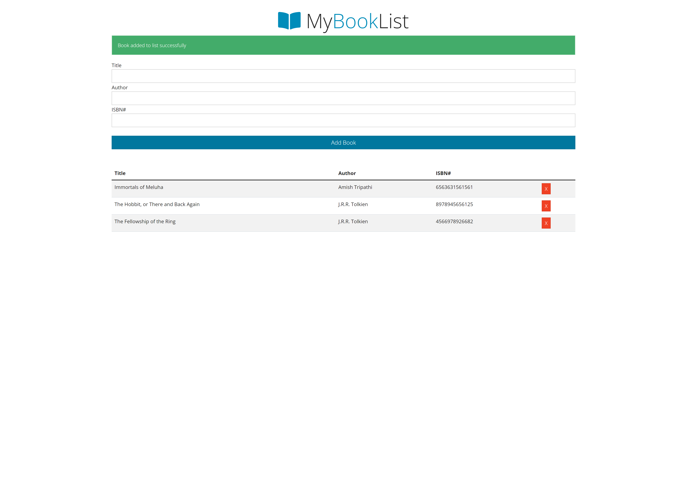
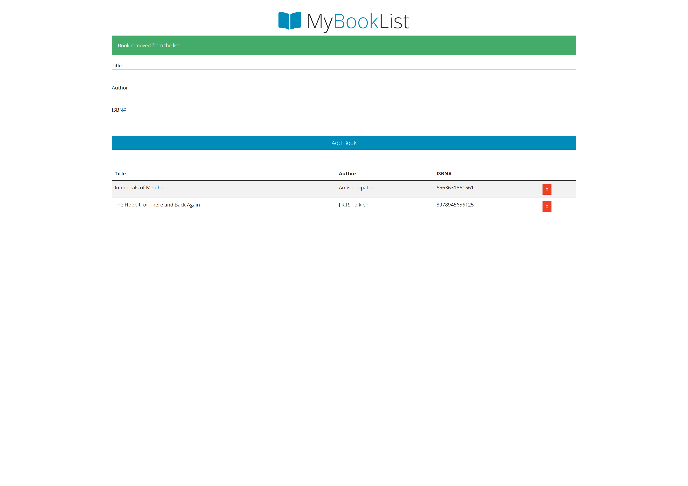
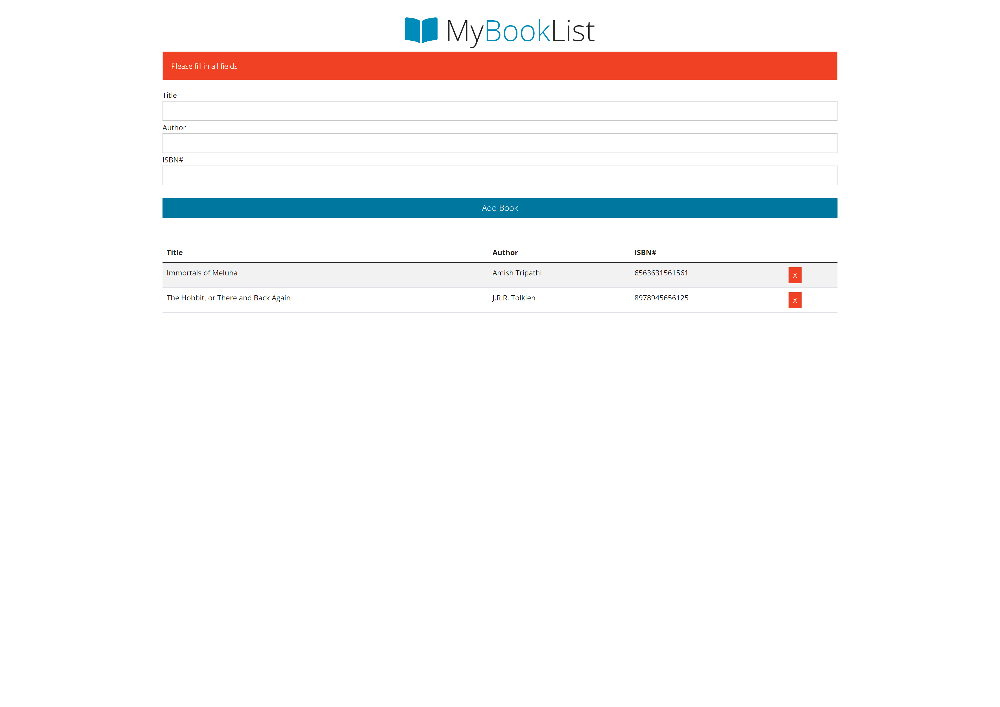

## Table of contents

- [Overview](#overview)
  - [The challenge](#the-challenge)
  - [Screenshot](#screenshot)
  - [Links](#links)
- [My process](#my-process)
  - [Built with](#built-with)
  - [What I learned](#what-i-learned)
- [Author](#author)


## Overview

This is a book listing app built using plain/vanilla JavaScript
### The challenge

Users should be able to:

- See a list of books
- Should be able to add books to the list
- Should be able to remove books from the list

### Screenshot






### Links

- Solution URL: [https://github.com/NandodkarAmogh/Library-App](https://github.com/NandodkarAmogh/Library-App)
- Live Site URL: [https://vanillajslibrary.netlify.app](https://vanillajslibrary.netlify.app)

## My process

### Built with

- Vanilla JavaScript
- HTML
- Bootstrap


### What I learned

Through this project I learnt many concepts like DOM manipulations, local Storage and object oriented programming. The below attached code snippet is of the local storage code which is used to store books.

```js
class Store{
    static getBooks(){
        let books;
        if(localStorage.getItem('books') === null){
            books = [];
        }
        else{
            books = JSON.parse(localStorage.getItem('books'));
        }
        return books;
    }

    static addBook(book){
        const books = Store.getBooks();
        books.push(book);
        localStorage.setItem('books',JSON.stringify(books));
    }

    static removeBook(isbn){
        const books = Store.getBooks();

        books.forEach((book,index) =>{
            if(book.isbn=== isbn){
                books.splice(index,1);
            }
        });

        localStorage.setItem('books',JSON.stringify(books));
    }

}
```


